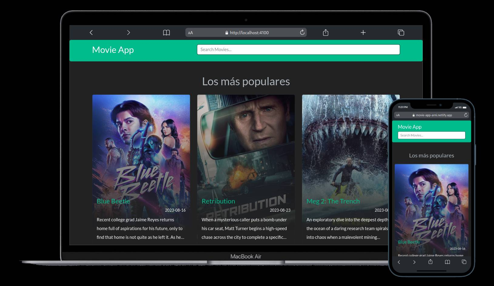

# MovieApp

### Pasos
1. Descargar el proyecto y abrirlo con el editor de su preferencia.
2. Abrir una terminal con la ruta del proyecto
3. Ejecutar el comando npm install
4. En la carpeta environments se encontrarán dos archivos con dos 3 variables
5. Se debe crear una cuenta en [https://developer.themoviedb.org/docs] y obtener una API KEY

